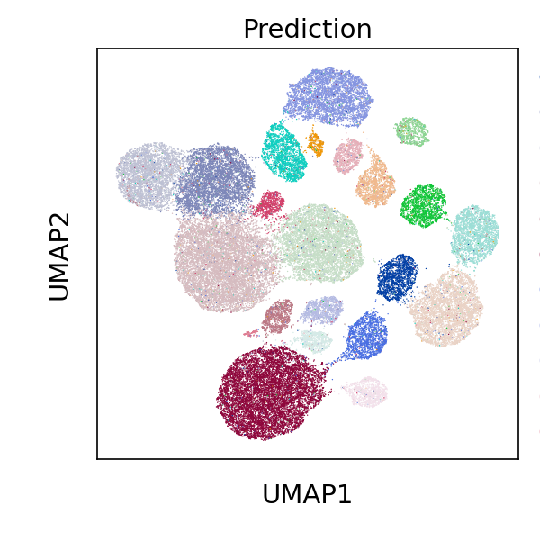

# cellannotation
Cell type annotation

# Environment
```
pip install scanpy
pip install pytorch-ignite
pip install typing_extensions
pip install tensorboardX
pip install torch-1.11.0+cu113-cp38-cp38-linux_x86_64.whl
```

# Use
Usage is as follows:

- dataset: Store reference datasets and query datasets
- notebook_demo: Demonstration of the annotation method on PBMC 10k
- results: Results with visualization

# Result
We can enter in the directory `results` to get the visualization.

In BMMC dataset, model predict cell types:


